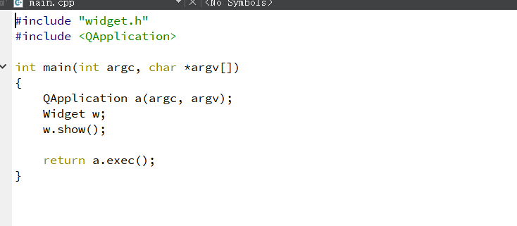
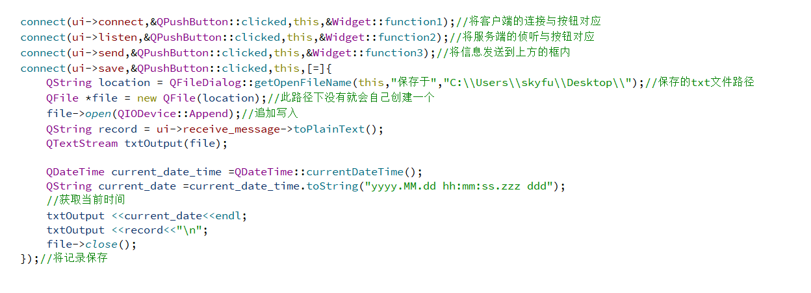
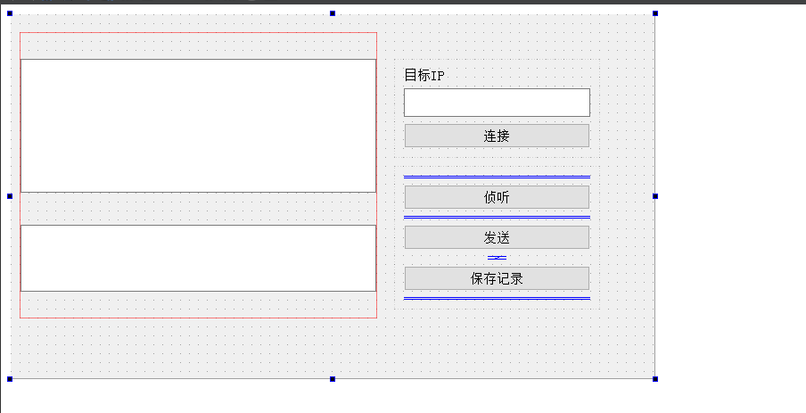
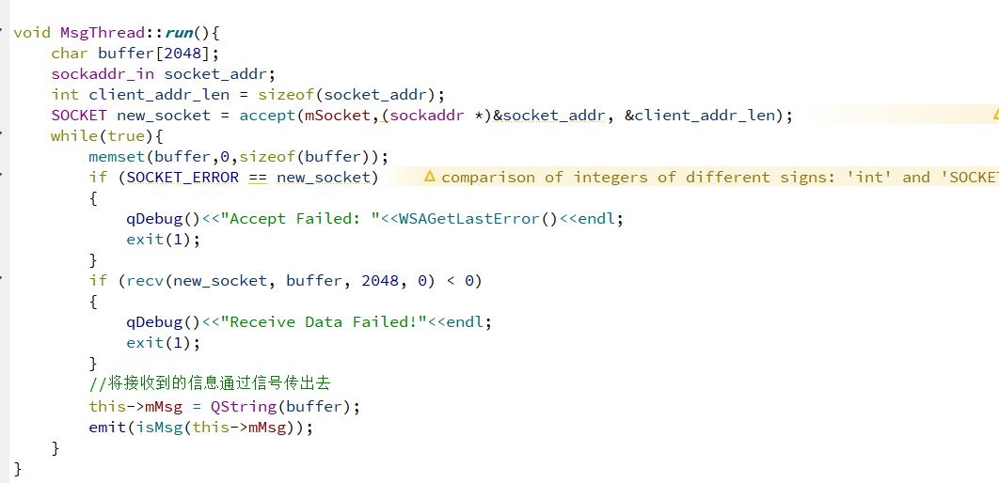
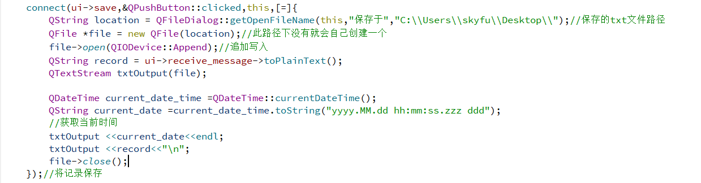
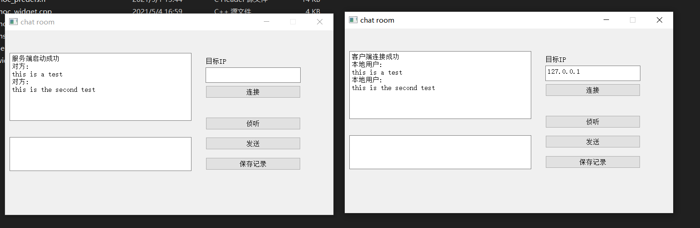
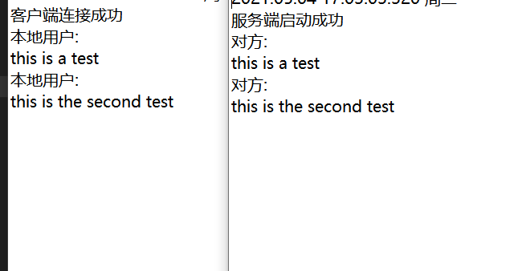
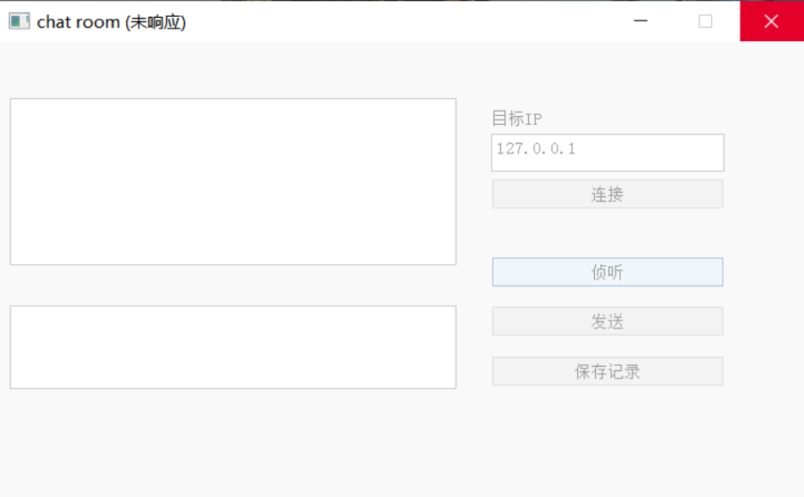

## 计算机网络实验八聊天程序

### 实验目的

1、 熟悉Qt的基本操作。

2、 基本了解基于对话框的windows应用程序的编写过程。

3、 对于Windows Socket编程建立初步概念。

### 实验要求

1、 应用Qt，实现网络数据传输。

2、 仿照本实验步骤，制作实用的局域网一对一聊天程序。

### 实验步骤

首先配置Qtcreator的环境，如果想使用winsock，需要在pro文件中添加：
` LIBS += -lws2_32`
然后在窗口widget文件中包含<winsock2.h>即可。

### 实验代码

main函数创建应用程序对象，创建窗口对象并调用show()函数显示，执行exec()让应用程序对象进入消息循环机制,同时让代码阻塞在这一行.

对弹出窗口大小，标题进行设置。

利用Qt的信号和槽的机制实现线程内部信息的传递。将下图的按键和对应要发生的事件结合，具体内容见注释。

因为ui进程不可以被阻塞，所以必须考虑多线程，另外用一个文件实现多线程：

多线程实现的功能就是对客户端的持续监听，继承了QThread类并重写了run()函数，当自己的多线程类调用start()函数时也就调用了run()函数，从而开辟新线程进行监听。

考虑到两个类之间进行通信困难，所以利用槽函数和connect机制进行参数的传递，在Widget中对收到的信息进行打印。

关于记录的保存：利用QFile进行文件读写，打开指定路径的文件并以追加写的方式进行文件读写。每次记录时先写入当时的时间在写入记录的内容。

### 结果截图：

发送信息：

保存记录：

### 遇到的问题

[Qt打包生成exe步骤和无法定位程序输入点_gxx_personality_v0于动态链接库 - 知乎 (zhihu.com)](https://zhuanlan.zhihu.com/p/130501729)

简述：将ws2_32.lib放到对应文件夹下即可正确打开多个窗口。

如果不使用多线程：

则UI进程会被阻塞，程序窗口将会出现未响应而最终强制被退出的情况。